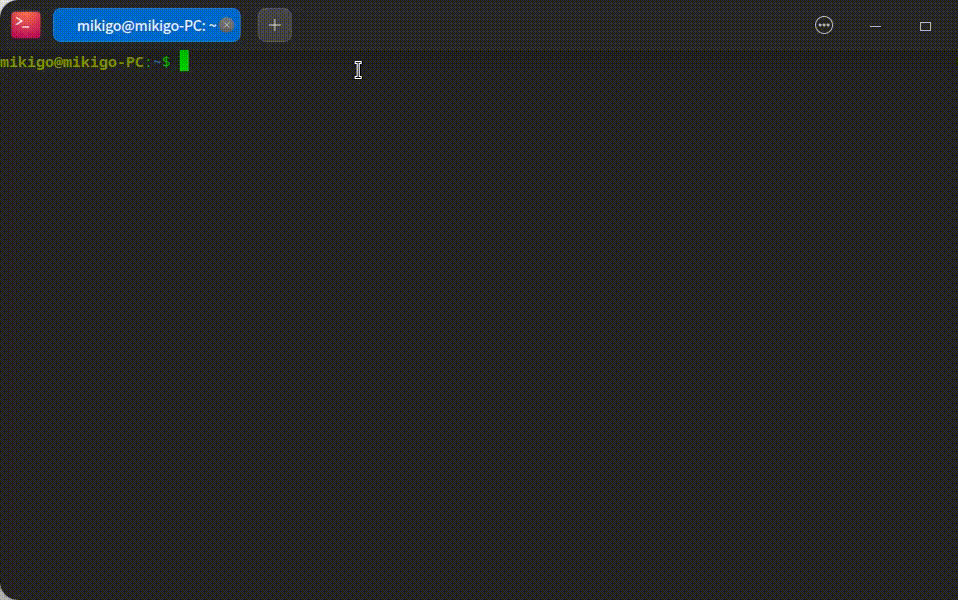

各位开源爱好者，感谢您一直以来对 YouQu 自动化测试框架的信赖与支持。随着技术的不断进步和市场需求的变化，YouQu 现已升级至更加先进、功能更强大的 [YouQu3](https://youqu.uniontech.com/) 版本。为了确保您能够继续享受到高效、稳定的自动化测试服务，我们诚挚地邀请您进行版本升级。

请注意，YouQu 版本已圆满完成其历史使命，在 `2025 年 6 月 1 日`之后我们将不再对其进行维护。为了保障您的测试环境和项目的持续发展，我们强烈建议您升级至 YouQu3（[迁移工具](https://gitee.com/deepin-autotest/youqu2-transfer-youqu3)）。在迁移过程中，有任何问题您可以在 [YouQu 官方兴趣小组](https://youqu.uniontech.com/SIG.html)咨询，我们将尽力帮助您顺利完成过渡。

------------------------------------

<p align="center">
  <a href="https://linuxdeepin.github.io/youqu">
    
  </a>
</p>
<p align="center">
    <em>YouQu（有趣），一个使用简单且功能强大的自动化测试框架。</em>
</p>


[](https://github.com/linuxdeepin/youqu/issues)
[](https://pypi.org/project/youqu/)


[](https://pepy.tech/project/youqu)
[](https://github.com/linuxdeepin/youqu)

---

**深度社区：<a href="https://github.com/linuxdeepin/youqu" target="_blank">linuxdeepin</a> | <a href="https://gitee.com/deepin-community/youqu" target="_blank">deepin-community</a>**

**欧拉社区：<a href="https://gitee.com/src-openeuler/youqu" target="_blank">openEuler</a>**

**龙晰社区：<a href="https://gitee.com/anolis/youqu" target="_blank">openAnolis</a>**

**官方文档：<a href="https://youqu.uniontech.com" target="_blank">https://youqu.uniontech.com</a>**

**欢迎加入 [YouQu官方兴趣小组](https://youqu.uniontech.com/SIG.html)**

---

YouQu（有趣）是统信公司（Deepin/UOS）开源的一个 Linux 操作系统的自动化测试框架，支持多元化元素定位和断言、用例标签化管理和执行、强大的日志和报告输出等特色功能，同时完美兼容 X11、Wayland 显示协议，环境部署简单，操作易上手。🔥

## [YouQu（有趣）能做什么]()

- [x] 💻 Linux 桌面应用 UI 自动化测试
- [x] 🌏 Web UI 自动化测试
- [x] 🚌 Linux DBus 接口自动化测试
- [x] 🚀 命令行自动化测试
- [x] 🕷️ HTTP 接口自动化测试

## [安装]()

从 PyPI 安装:


```shell
$ sudo pip3 install youqu
```

<details> 
    <summary><b>不加 sudo ?</b></summary> 

-----------------------

不加 sudo 也可以：

```shell
pip3 install youqu
```

但可能出现 `youqu-startproject` 命令无法使用；

这是因为不加 `sudo` 时，`youqu-startproject` 命令会生成在 `$HOME/.local/bin` 下，

而此路径可能不在环境变量（`PATH`）中，因此您需要添加环境变量：

```shell
export PATH=$PATH:$HOME/.local/bin
```

-----------------------

</details>


## [创建项目]()

您可以在任意目录下，使用 `youqu-startproject` 命令创建一个项目：

```shell
$ youqu-startproject my_project
```

注意：所有命令不要以 `root` 用户执行！

如果 `youqu-startproject` 后面不加参数，默认的项目名称为：`youqu` ；



## [安装依赖]()

安装部署 YouQu 执行所需环境： 

```shell
$ cd my_project
$ bash env.sh
# 使用的默认密码是 1；
# 您可以使用 -p 选项传入密码：bash env.sh -p ${my_password}；
# 也可以修改配置文件 setting/globalconfig.ini 里面的 PASSWORD 配置项；
```

## [创建 APP 工程]()

使用 `startapp` 命令自动创建 APP 工程：

```shell
$ youqu manage.py startapp autotest_deepin_some
```

自动创建的 APP 工程遵循完整的 PO 设计模式，让你可以专注于用例和方法的编写维护。

在 `apps` 目录下会自动创建一个 APP 工程：`autotest_deepin_some`，同时新建好工程模板目录和模板文件：

```shell
my_project
├── apps
│   ├── autotest_deepin_some  # <-- APP工程
...     ├── ...
```

**在你的远程 Git 仓库中，只需要保存 APP 工程这部分代码即可。**

`autotest_deepin_some` 是你的  APP 工程名称，在此基础上，你可以快速的开始你的 AT 项目，更重要的是确保创建工程的规范性。

`apps` 目录下可以存在任意多个 APP 工程。

[运行]()
-------

### [1. 执行管理器]()

在项目根目录下有一个 `manage.py` ，它是一个执行器入口，提供了本地执行、远程执行等的功能。

### [2. 本地执行]()


```shell
$ youqu manage.py run
```

#### [2.1. 命令行参数]()

在一些 CI 环境下使用命令行参数会更加方便：


```shell
$ youqu manage.py run -a apps/autotest_deepin_some -k "xxx" -t "yyy"
```

更多用法可以使用 `-h` 或 `--help` 查看。

#### [2.2. 配置文件]()

通过配置文件配置参数

在配置文件 [setting/globalconfig.ini](https://github.com/linuxdeepin/youqu/blob/master/setting/globalconfig.ini)  里面支持配置对执行的一些参数进行配置。

### [3. 远程执行]()

远程执行就是用本地作为服务端控制远程机器执行，远程机器执行的用例相同。

使用 `remote` 命令：


```shell
$ youqu manage.py remote
```

## [贡献]()

[贡献文档](https://youqu.uniontech.com/CONTRIBUTING.html) 


## [开源许可证]()

YouQu 在 [GPL-2.0](https://github.com/linuxdeepin/youqu/blob/master/LICENSE) 下发布。
